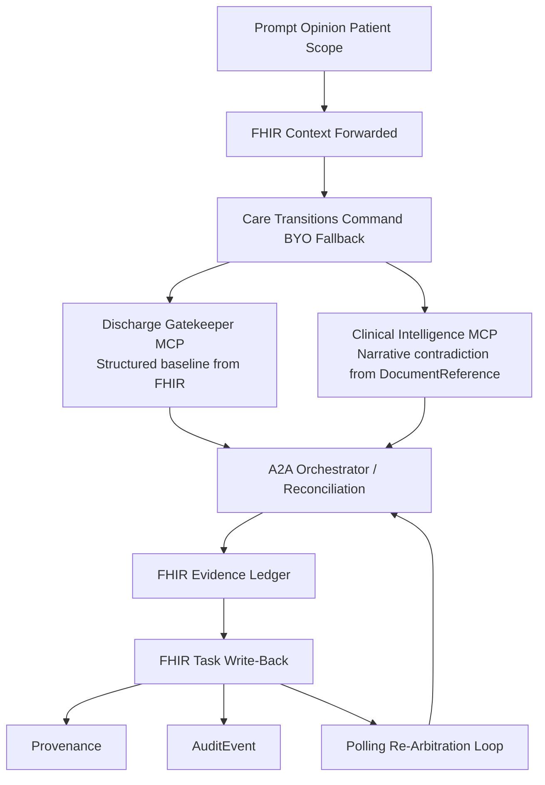
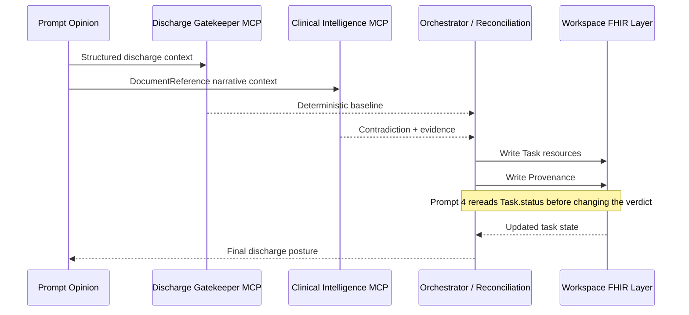

# Care Transitions Command

**A FHIR-native care-transitions control plane that catches hidden note-level contradictions, converts them into evidence-linked blocking Tasks, and holds unsafe discharges until the clinical gate actually clears.**

<table>
  <tr>
    <td bgcolor="#F3E8FF">
      <strong>Track:</strong> Full Agent: MCP + A2A &nbsp;·&nbsp; <strong>Platform:</strong> Prompt Opinion &nbsp;·&nbsp; <strong>Protocol:</strong> A2A v1 / JSON-RPC 2.0 / FHIR R4
    </td>
  </tr>
</table>

---

## The Held-Out Demo Patient: Daniel Brooks

Daniel looks discharge-ready on every structured field: creatinine improved, oral diuretics entered, cardiology follow-up scheduled.

Then three late notes arrive:

1. **Pharmacy note, 18:15** — the medication bridge, sacubitril/valsartan, is not available tonight; prior authorization is pending until Monday; the patient has only two days of old stock at home.
2. **Nursing note, 18:40** — late orthopnea and 1.8 kg weight gain since the morning assessment.
3. **Case-management note, 19:05** — pickup logistics failure; no confirmed caregiver tonight.

The system escalates to `not_ready`, cites the contradiction, writes blocking FHIR Tasks, records Provenance chains, and refuses to clear discharge until `clinical_stability` resolves.

### FHIR Tasks Written to the Prompt Opinion Workspace

| Task ID | Category | Status |
|---|---|---|
| `dd4c6f79-...` | `clinical_stability` | `requested` |
| `98f80645-...` | `medication_reconciliation` | `completed` |
| `3ed46a0f-...` | `patient_education` | `completed` |

At re-arbitration, medication access and patient education resolved. Clinical stability remained open. The gate stayed closed.

---

## The Inspiration

Discharge failure rarely comes from a missing summary. It comes from a contradiction that arrived too late, lived in the wrong layer, and never became explicit work.

The chart can look perfect: vitals stable, follow-up scheduled, medications reconciled. And discharge can still be unsafe because the real story changed **after** the structured snapshot:

- A late nursing note documents orthopnea and weight gain that the morning assessment never captured.
- A pharmacy note reveals the medication bridge is not actually available tonight.
- A case-management addendum shows that the caregiver who was supposed to pick up the patient cannot come.

By the time these contradictions surface in normal workflow, the patient may already be in a cab home. The risk was never in the structured fields. It was in the narrative — and nobody converted that narrative into reviewable, trackable coordination work.

Most discharge tools answer the question. **Care Transitions Command changes the operational state.**

---

## The Core Primitive

<table>
  <tr>
    <td bgcolor="#EDE9FE">
      <strong>Blocking evidence creates FHIR Tasks. Task completion opens the gate. The system holds discharge until the FHIR layer says otherwise.</strong>
    </td>
  </tr>
</table>

This project is built around an exact operational wedge:

1. The deterministic chart can still say `ready`.
2. The contradiction can still arrive in narrative evidence.
3. The system converts that contradiction into concrete FHIR coordination artifacts.
4. Discharge remains held until the FHIR layer reflects the real state.

```
Structured chart says READY
        |
        v
Clinical notes are checked anyway
        |
        v
Hidden contradiction found in late notes
        |
        v
Blocking FHIR Tasks are written
        |
        v
Discharge gate stays closed until Task.status resolves
```

---

## The 4-Prompt Demo

Care Transitions Command drives a precise, held-out demonstration of hidden-risk escalation.

### Prompt 1 — "Is this patient safe to discharge today?"

The structured chart says `ready`. The system checks the notes anyway. A hidden contradiction surfaces. The final answer becomes `not_ready`. Both postures are visible: the structured baseline that looked safe, and the narrative-grounded final status that changed it.

### Prompt 2 — "What hidden risk changed that answer? Show me the contradiction and the evidence."

The system points to the exact nursing note, pharmacy note, and case-management addendum that broke the structured posture. Citations are live FHIR `DocumentReference` IDs. Every finding has a source. Nothing is asserted without a note anchor.

### Prompt 3 — "What exactly must happen before discharge, and prepare the transition package."

The contradiction becomes explicit work:
- Prioritized next steps with owners and timing.
- A clinician handoff brief & patient-facing hold instructions.
- Blocking FHIR `Task` resources are written to the workspace.
- Evidence links through `reasonReference` and recorded `Provenance`.

### Prompt 4 (Re-Arbitration) — Checking the Gate

Some blocking Tasks resolve (e.g., medication access and home monitoring). The system re-reads live `Task.status`. Non-clinical gates clear, but if `clinical_stability` is still open, the discharge remains held. **This is not a summarization tool. It is a control system with memory.**

```json
{
  "resourceType": "Task",
  "id": "dd4c6f79-...",
  "status": "requested",
  "intent": "order",
  "description": "Reassess late symptom change: orthopnea and weight gain.",
  "reasonReference": {
    "reference": "DocumentReference/7978a116-..."
  }
}
```

---

## Architecture

Care Transitions Command is composed of three tightly scoped components:

1. **Discharge Gatekeeper MCP** — the deterministic structured discharge spine. Computes the discharge posture from FHIR `Observation`, `MedicationRequest`, `ServiceRequest`, and `Encounter` resources. Never reasons over free-text notes; every output is deterministic.
2. **Clinical Intelligence MCP** — bounded narrative intelligence that reads FHIR `DocumentReference` resources to detect contradictions against the structured baseline. Returns cited findings with explicit `DocumentReference` anchors. Never fabricates hidden risk when no contradiction exists.
3. **External A2A Orchestrator** — synchronous prompt-level coordination across both MCPs. Fuses deterministic and narrative evidence via a 12-row decision matrix. Writes blocking FHIR `Task` resources with `reasonReference` links, records `Provenance`, and supports polling re-arbitration by re-reading live `Task.status`.





---

## The 12-Row Decision Matrix

The final verdict is not produced by the LLM. It is produced by a deterministic decision matrix that fuses the structured baseline and the hidden-risk finding.

| Row | Structured Baseline | Hidden Risk | Disposition Impact | Final Verdict |
|---:|---|---|---|---|
| 1 | `ready` | `no_hidden_risk` | none | `ready` |
| 2 | `ready` | `hidden_risk_present` | caveat | `ready_with_caveats` |
| **3** | **`ready`** | **`hidden_risk_present`** | **not_ready** | **`not_ready`** |
| 4 | `ready_with_caveats` | `no_hidden_risk` | none | `ready_with_caveats` |
| 5 | `ready_with_caveats` | `hidden_risk_present` | caveat | `ready_with_caveats` |
| 6 | `ready_with_caveats` | `hidden_risk_present` | not_ready | `not_ready` |
| 7 | `not_ready` | `no_hidden_risk` | none | `not_ready` |
| 8 | `not_ready` | `hidden_risk_present` | caveat | `not_ready` |
| 9 | `not_ready` | `hidden_risk_present` | not_ready | `not_ready` |
| 10 | `ready` | `inconclusive` | uncertain | `ready_with_caveats` |
| 11 | `ready_with_caveats` | `inconclusive` | uncertain | `ready_with_caveats` |
| 12 | `not_ready` | `inconclusive` | uncertain | `not_ready` |

**Row 3 is the canonical demo row:** structured baseline `ready`, hidden risk present, disposition impact `not_ready`, final verdict `not_ready`.

Rows 10-12 require manual review because the narrative layer returned `inconclusive`.

---

## Deterministic vs. LLM-Based

The deterministic layer exists because generative AI should not invent discharge blockers, fabricate evidence, or hallucinate FHIR resources. It is a safety and credibility choice, not an absence of AI.

| Layer | Responsibilities |
|---|---|
| **Deterministic** | Structured patient-context normalization; canonical blocker taxonomy and severity scoring; 12-row verdict fusion matrix; FHIR `Task` resource drafting with deterministic UUIDv5 generation; `Provenance` chain construction; re-arbitration polling logic; red-flag rule evaluation against structured observations. |
| **LLM, bounded** | Free-text note interpretation and contradiction detection; evidence-to-blocker mapping from narrative content; plain-language contradiction summaries; clinician handoff brief composition; patient-facing discharge instruction generation. |

Every clinical claim has a `DocumentReference` anchor. The model's job is to read unstructured input, identify which contradictions matter, reason across the structured outputs, and write the result. A rules engine cannot do that at the open-ended scope this clinical workflow demands.

**The LLM is only used by the Clinical Intelligence MCP.** All structured baseline logic in the Discharge Gatekeeper MCP and all FHIR write-back in the orchestrator are fully deterministic.

### What Only Generative AI Can Do Here

A rules engine can check whether SpO2 is below 90%. It **cannot** read a free-text nursing note and understand that "patient became visibly dyspneic after six stairs" contradicts the structured resting SpO2 of 94%.

Care Transitions Command's generative AI layer (running Gemma 4 31B-IT or Gemini 3.1 Flash-Lite) performs three distinct tasks:

1. **Unstructured narrative → structured clinical contradiction.** Nursing notes, pharmacy clarifications, and case-management addenda are free-text documents written by humans for humans, in wildly varying styles. The model extracts the specific claim that contradicts the structured baseline and maps it to a canonical blocker category.
2. **Open-ended evidence composition.** The Clinical Intelligence MCP decides which notes to read, when a contradiction is strong enough to escalate, and how to compose the contradiction summary — all at runtime, given the patient's actual documents.
3. **Cross-layer synthesis at the patient level.** The signature insight — "the structured chart said `ready`, but this nursing note changes the answer" — emerges from joining two independent data sources at inference time.

---

## How a Request Flows

A single discharge assessment completes in under 30 seconds against the live Prompt Opinion FHIR workspace.

```
 1. Clinician opens Prompt Opinion and selects a patient
           |
           v
 2. Prompt Opinion forwards Patient Scope + FHIR context
           |
           v
 3. Orchestrator calls Discharge Gatekeeper MCP
           |
           v
 4. Structured baseline is computed
           |
           v
 5. If note review is warranted, Clinical Intelligence MCP reads notes
           |
           v
 6. Narrative contradictions are mapped to evidence anchors
           |
           v
 7. The 12-row matrix fuses structured + narrative posture
           |
           v
 8. If not_ready, blocking FHIR Tasks are drafted and written
           |
           v
 9. Provenance chains link evidence → task → verdict
           |
           v
10. On re-arbitration, live Task.status is re-read before the gate changes
```

---

## Technology Stack

| Layer | Technology |
|---|---|
| Agent framework | Model Context Protocol (MCP) SDK v1.25.1 |
| Runtime | TypeScript 5.8, Express 5.1, tsx 4.19 |
| Schema validation | Zod 4.2 |
| FHIR client | `@smile-cdr/fhirts` 2.3.0 + native FHIR R4 REST |
| Auth / tokens | `jose` 6.0 for JWT and Bearer token handling |
| Protocol | A2A v1 over JSON-RPC 2.0, synchronous, no streaming |
| Context propagation | Prompt Opinion Patient Scope + FHIR R4 Bearer token |
| LLM, primary | Gemma 4 31B-IT via Google AI Studio API |
| LLM, alternative | Gemini 3.1 Flash-Lite, configurable via `CLINICAL_INTELLIGENCE_GOOGLE_MODEL` |
| Hosting | Local runtimes exposed via ngrok |
| User-facing surface | Prompt Opinion workspace |
| Evidence layer | FHIR R4 `Task`, `Provenance`, and `DocumentReference` |

The Clinical Intelligence MCP selects its reasoning model via the `CLINICAL_INTELLIGENCE_GOOGLE_MODEL` environment variable. When no API key is present, the system falls back to a deterministic heuristic provider so that smoke checks remain runnable without credentials.

---

## Scenario Evidence Matrix

| Scenario | Baseline | Narrative | Final | What It Proves |
|---|---|---|---|---|
| Maria trap patient | `ready` | `hidden_risk_present` | `not_ready` | Structured `ready` becomes `not_ready` when late nursing and case-management notes expose transition blockers. |
| Maria ablation control | `ready` | `no_hidden_risk` | `ready` | Removing contradiction notes prevents escalation. |
| Clean no-risk control | `ready` | `no_hidden_risk` | `ready` | Reassuring narrative evidence does not fabricate hidden risk. |
| Duplicate-signal control | `ready_with_caveats` | `no_hidden_risk` | `ready_with_caveats` | Narrative signals already present in deterministic blockers are suppressed, not double-counted. |
| Inconclusive or missing narrative | `ready` | `inconclusive` | `ready_with_caveats` | Missing evidence triggers `manual_review` without fabricated escalation. |
| Alternative home-support risk | `ready` | `hidden_risk_present` | `not_ready` | A non-respiratory social support contradiction can still change transition status. |
| Medication access hidden risk | `ready` | `hidden_risk_present` | `not_ready` | Detector is not hardcoded to oxygen or stairs; blocked anticoagulation access can independently stop discharge. |

---

## Challenges We Ran Into

### A2A v1 Dialect Mismatch

The platform's A2A v1 validation expects a rich agent card with a public URL, protocol version, non-empty skills, and `text/plain` modes. Our initial sparse card produced a hard `422` during Prompt Opinion external-agent validation.

**Fix:** a complete agent-card generator that exposes all required fields and keeps the runtime compatible with platform validation.

### FHIR Context Alignment Across Three Runtimes

Prompt Opinion Patient Scope, MCP tool bindings, and visible chat transcripts had to stay aligned across Discharge Gatekeeper MCP, Clinical Intelligence MCP, and the external A2A orchestrator. Any drift produced silent failures where the tool executed but the transcript showed no result.

**Fix:** explicit request-id correlation logging and smoke checks that verify end-to-end evidence persistence.

### Held-Out Demo Patient vs. Regression Trap

The natural instinct is to build the demo around the patient whose notes you hand-curated until the demo works. We forced a held-out Daniel Brooks lane: his notes were never edited to make the contradiction more dramatic, and his structured baseline was never tweaked to make the flip more obvious.

### FHIR Write-Back Honesty

We write real `Task` and `Provenance` resources to Prompt Opinion's workspace FHIR server. `AuditEvent` write shape is stricter than our current output; local proof remains green, but the live path for `AuditEvent` is not claimed. We use polling re-arbitration instead of asserting webhook behavior we cannot demonstrate to a judge in real time.

### Stale ngrok and Runtime State

During repeated live proof sessions, tunnel URLs changed, MCP registrations became stale, and smoke checks passed locally while the workspace saw stale tool definitions.

**Fix:** a full bootstrap-and-registration script that tears down and rebuilds the Prompt Opinion connection before every judged session.

---

## Accomplishments

- A **held-out live demo patient**, Daniel Brooks, whose contradiction lane writes real Prompt Opinion `Task` and `Provenance` artifacts — no demo hacks, no hand-tuned notes.
- A **clean control patient**, Olivia Chen, who stays `ready`, triggers zero blocking Tasks, and proves the system does not force escalation when no contradiction exists.
- A **Prompt 4 re-arbitration path** that re-reads live `Task.status` and still refuses to clear discharge when `clinical_stability` is unresolved — proving the system has durable state grounded in FHIR, not just in the conversation thread.
- A **scenario-matrix safety case**, Eleanor Singh, for mobility, fall risk, and home-support failure — showing the contradiction pattern generalizes beyond cardiac and respiratory presentations.
- A **deterministic + LLM hybrid** where every FHIR resource shape is hardcoded and every contradiction finding has a `DocumentReference` citation. The model advises; the deterministic layer decides and writes.
- A **direct Prompt Opinion BYO lane and an A2A architecture lane** that both stay inspectable and honest about which is primary and which is fallback.

---

## Scenario Pack & Proof

| Patient | Role In Proof | Expected Outcome |
| --- | --- | --- |
| **Daniel Brooks** | Held-out live demo patient | `not_ready` after contradiction; Prompt 4 partial resolution still does not clear `clinical_stability` |
| **Olivia Chen** | Clean control | `ready`, `no_hidden_risk`, zero blocking Tasks |
| **Eleanor Singh** | Scenario matrix safety case | `not_ready` with mobility / fall / home-support failure |
| **Maria Alvarez** | Regression trap | COPD exacerbation; SpO2 94% at rest drops to 82% on exertion; contradiction remains conservative and avoids Daniel bleed |

<table>
  <tr>
    <td bgcolor="#EEF2FF">
      <strong>Live on Prompt Opinion's workspace FHIR layer</strong><br/>
      Daniel, Maria, Olivia, and Eleanor all have prompt-opinion-hosted <code>DocumentReference</code> evidence. Daniel's live proof path also writes real PO <code>Task</code> and <code>Provenance</code> resources.
    </td>
  </tr>
</table>

---

## Local Run

### Install

```bash
npm --prefix po-community-mcp-main/typescript ci
npm --prefix po-community-mcp-main/clinical-intelligence-typescript ci
npm --prefix po-community-mcp-main/external-a2a-orchestrator-typescript ci
```

### Seed Local FHIR

```bash
npx tsx po-community-mcp-main/scripts/seed-fhir-bundles.ts
```

### Start Services

```bash
./po-community-mcp-main/scripts/start-two-mcp-local.sh
./po-community-mcp-main/scripts/start-a2a-local.sh
./po-community-mcp-main/scripts/start-public-path-proxy-local.sh
```

### Health Checks

```bash
./po-community-mcp-main/scripts/check-two-mcp-readiness.sh
./po-community-mcp-main/scripts/check-a2a-readiness.sh
curl -s https://underpaid-passion-unloaded.ngrok-free.dev/readyz
```

---

## Proof Artifacts

- Current endgame audit: `output/endgame/runs/20260510T101519Z/final-endgame-audit.md`
- Current FHIR consolidation proof: `output/endgame/runs/20260510T160443Z-fhir-consolidation/po-workspace-proof/summary.md`
- Current Daniel full browser proof: `output/playwright/20260510T-final-daniel-p1-p4-autoprep/`
- Current Olivia control: `output/playwright/20260510T-final-olivia-p1-longwait/`
- Current A2A consult proof: `output/playwright/20260510T-final-a2a-vc-longwait/`

---

## Safety, Privacy & Scope Boundaries

**Decision support, not autonomous discharge.** Every blocking Task carries `status="requested"`, not `completed`. Every drafted resource carries `review_required: true`. A licensed clinician must approve before anything reaches finality.

**Defers to the care team.** Patient-facing language never says "you cannot leave." It says "contact your care team before discharge."

**Synthetic data by design for the hackathon; production-ready for real FHIR.** Demo patients are hand-built FHIR R4 transaction bundles. The same agent code runs unchanged against a real institutional FHIR server: it speaks FHIR R4 over Bearer token, the protocol modern EHRs expose.

**Compliance posture.** Prompt Opinion Patient Scope means the agent operates entirely under the workspace's existing FHIR authorization. Credentials are never stored, patient data is never persisted between requests, and the FHIR Bearer token is request-scoped. That posture is HIPAA- and GDPR-compatible by construction.

**Boundaries on scope.** The system classifies severity and recommends actions. It does not diagnose, it does not order, and it does not auto-message patients. It is a specialist consult invoked by a clinician, scoped to a single workspace and a single patient at a time.

**Feasibility in a real healthcare system.** The technical plumbing — FHIR R4, deterministic discharge rules, MCP-based tool composition, and A2A v1 synchronous orchestration — is production-grade and already standard at institutions with active interoperability programs. The path from this submission to a clinical pilot is a validation and procurement conversation, not a re-architecture.

---

*Care Transitions Command is decision support, not autonomous discharge authority. Every finding cites a source. Every gate has an owner. Every verdict is reviewable by a clinician.*

---

**Built with:** TypeScript · Model Context Protocol (MCP) · A2A v1 / JSON-RPC 2.0 · FHIR R4 · Zod · Express 5 · Gemma 4 31B-IT · Gemini 3.1 Flash-Lite · Google AI Studio API · Prompt Opinion Patient Scope · ngrok · `@smile-cdr/fhirts` · `jose`
