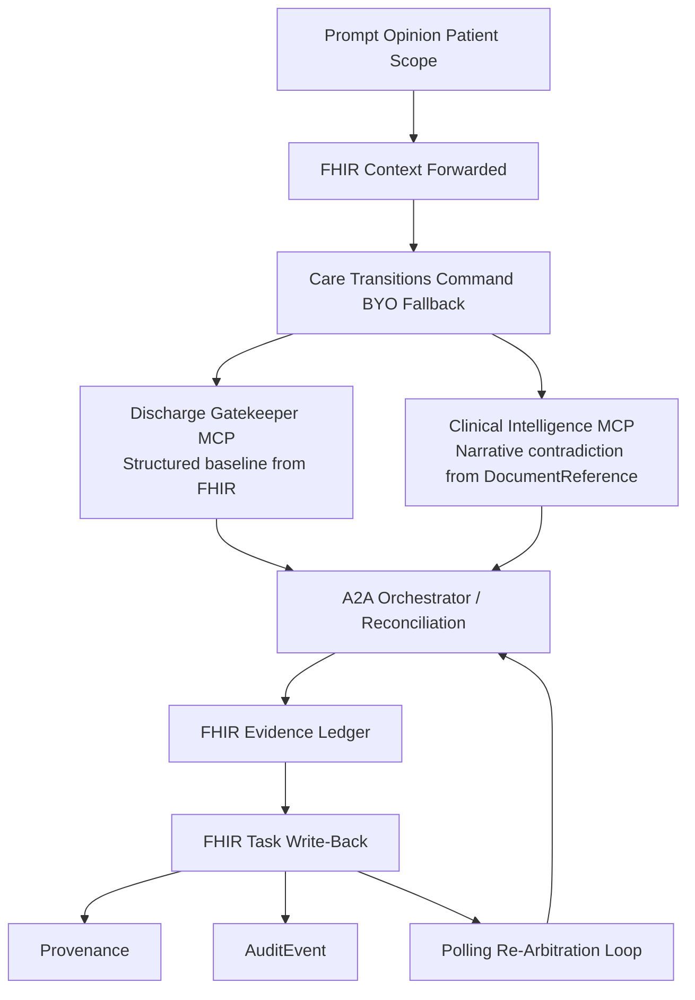

# Care Transitions Command

Care Transitions Command is a Prompt Opinion-native discharge control plane that stops an unsafe discharge when the contradiction lives in narrative evidence, not in the clean structured chart.

## The Demo In One Sentence

Daniel Brooks looks discharge-ready on the deterministic spine. A late pharmacy note, nursing note, and case-management note contradict that posture. The system escalates to `not_ready`, writes blocking FHIR Tasks, and refuses to clear discharge until the FHIR layer says the right gates are resolved.

## The Primitive

**Blocking evidence creates FHIR Tasks. Task completion opens the gate. The system holds discharge until the FHIR layer says otherwise.**

## Why This Matters

Most discharge tooling can summarize a chart. That is not enough.

The real failure mode is this:

- the structured chart says the patient looks ready
- the dangerous contradiction appears later in notes
- no one turns that contradiction into explicit operational work

Care Transitions Command is built to close that gap.

## Architecture



## What Each Component Does

### Discharge Gatekeeper MCP

Owns the deterministic spine:

- structured patient-context normalization
- discharge-readiness posture from bounded structured evidence
- canonical blocker taxonomy
- next-step scaffolding

### Clinical Intelligence MCP

Owns bounded narrative intelligence:

- contradiction detection in late notes and documents
- hidden-risk discovery against the structured posture
- evidence-backed escalation or de-escalation
- concise contradiction summaries with visible FHIR references

### external A2A orchestrator

Owns the synchronous architecture-proof lane:

- prompt-level coordination across both MCPs
- fused answer assembly
- FHIR Task / Provenance / AuditEvent write-back
- polling re-arbitration after partial resolution

The judged direct lane still runs through Prompt Opinion Patient Scope with `Care Transitions Command BYO Fallback`.

## Honest Local Demo Note

Structured EHR resources — observations, medications, orders — flow through Prompt Opinion’s FHIR context. Narrative notes live in the care documentation layer, accessed through the Clinical Intelligence MCP.

For the local endgame proof, Prompt Opinion patient UUIDs for Daniel, Maria, and Olivia are mapped into seeded local FHIR bundles. That lets the runtime prove deterministic reads, Task write-back, Provenance, AuditEvent, and polling re-arbitration honestly, without pretending this is a production hospital deployment.

## Held-Out Scenario Pack

### Daniel Brooks

Final live demo patient:

- heart-failure discharge
- medication bridge failure
- late orthopnea / weight-change concern
- broken home monitoring
- medication pickup logistics failure

### Olivia Chen

Clean control:

- remains `ready`
- explicit `no_hidden_risk`
- zero blocking Tasks

### Eleanor Singh

Scenario-matrix case:

- mobility safety
- patient education
- home support contradiction

### Maria Alvarez

Regression trap:

- preserves the canonical contradiction lane

## What The User Should See

1. a final discharge verdict
2. blocker categories with visible evidence
3. explicit FHIR references
4. owner/action/timing next steps
5. clinician handoff brief
6. patient-facing hold / discharge guidance

## Re-Arbitration

Prompt 4 is not just better prose.

The backend:

1. rereads encounter-scoped FHIR Tasks
2. marks only resolved gates complete
3. recomputes unresolved blocker categories
4. leaves `clinical_stability` unresolved when orthopnea persists
5. writes fresh `AuditEvent` and `Provenance` artifacts

That is why partial resolution does **not** falsely clear discharge.

## Safety Boundaries

- no autonomous discharge authority
- no custom frontend
- no third MCP
- no A2A streaming
- no production EHR integration claim
- no full Epic SMART claim
- no real webhook/subscription dependency claim

This system supports clinician review. It does not replace it.

## Local Run

### Install

```bash
npm --prefix po-community-mcp-main/typescript ci
npm --prefix po-community-mcp-main/clinical-intelligence-typescript ci
npm --prefix po-community-mcp-main/external-a2a-orchestrator-typescript ci
```

### Seed Local FHIR

```bash
npx tsx po-community-mcp-main/scripts/seed-fhir-bundles.ts
```

### Start Services

```bash
./po-community-mcp-main/scripts/start-two-mcp-local.sh
./po-community-mcp-main/scripts/start-a2a-local.sh
./po-community-mcp-main/scripts/start-public-path-proxy-local.sh
```

### Health Checks

```bash
./po-community-mcp-main/scripts/check-two-mcp-readiness.sh
./po-community-mcp-main/scripts/check-a2a-readiness.sh
```

## Prompt Opinion Proof Path

### Setup

- reuse the existing Prompt Opinion demo workspace
- select `Patient` scope
- select `Daniel Brooks`
- confirm `FHIR Context`
- select `Care Transitions Command BYO Fallback`

### Primary Prompt Set

1. `Is this patient safe to discharge today?`
2. `What hidden risk changed that answer? Show me the contradiction and the evidence.`
3. `What exactly must happen before discharge, and prepare the transition package.`
4. `New updates arrived: the medication bridge was delivered to bedside and the daughter arranged a working home scale, but the patient still reports orthopnea when lying flat. Re-arbitrate the discharge gates from the FHIR Tasks and evidence.`

### Current Runtime Note

- Prompt Opinion model target: `GoogleFree / gemini-3.1-flash-lite`
- local Clinical Intelligence runtime may be run in `heuristic` mode for live proof stability when the Google-backed hidden-risk path is flaky

## Validation Commands

Focused endgame commands used in this branch:

```bash
npm --prefix po-community-mcp-main/typescript run typecheck
npm --prefix po-community-mcp-main/clinical-intelligence-typescript run typecheck
npm --prefix po-community-mcp-main/external-a2a-orchestrator-typescript run typecheck
npm --prefix po-community-mcp-main/typescript run smoke:fhir-native-ingest
npm --prefix po-community-mcp-main/clinical-intelligence-typescript run smoke:fhir-narrative-ingest
npm --prefix po-community-mcp-main/clinical-intelligence-typescript run smoke:fhir-ledger
npm --prefix po-community-mcp-main/clinical-intelligence-typescript run smoke:narrative
npx tsx po-community-mcp-main/clinical-intelligence-typescript/smoke/fhir-direct-patient-scope-smoke.ts
npm --prefix po-community-mcp-main/external-a2a-orchestrator-typescript run smoke:fhir-rearbitration
```

## Artifacts

- endgame run folder: `output/endgame/runs/20260510T101519Z/`
- Prompt Opinion historical proof bundles: `output/prompt-opinion-e2e/runs/`

## Read Next

- `PLAN.md`
- `docs/phase10-fhir-native-control-plane.md`
- `docs/phase10-heldout-patients.md`
- `docs/fhir-evidence-writeback-spec.md`
- `docs/prompt-opinion-integration-runbook.md`
- `docs/evals.md`
