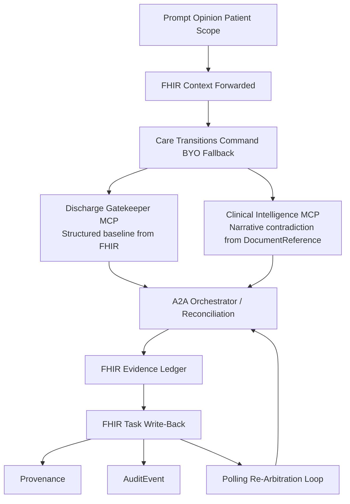
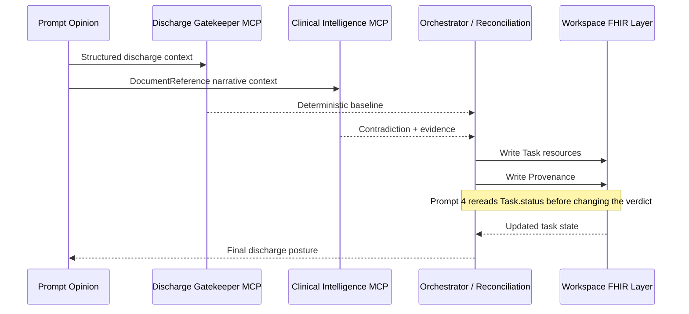

# Care Transitions Command

Care Transitions Command is a Prompt Opinion-native discharge control plane that catches the late contradiction a clean structured chart missed, writes blocking FHIR work items, and holds discharge until the FHIR layer says the right gates are resolved.

<table>
  <tr>
    <td bgcolor="#F3E8FF">
      <strong>Held-Out Demo</strong><br/>
      Daniel Brooks looks discharge-ready on the deterministic spine. A late pharmacy note, nursing note, and case-management note contradict that posture. The system escalates to <code>not_ready</code>, writes blocking FHIR Tasks, and refuses to clear discharge while <code>clinical_stability</code> remains unresolved.
    </td>
  </tr>
</table>

## The Primitive

<table>
  <tr>
    <td bgcolor="#EDE9FE">
      <strong>Blocking evidence creates FHIR Tasks. Task completion opens the gate. The system holds discharge until the FHIR layer says otherwise.</strong>
    </td>
  </tr>
</table>

## Why This Matters

Most discharge tools answer the question.

Care Transitions Command changes the operational state.

The dangerous moment in discharge planning is not that the model failed to summarize a chart. The dangerous moment is that a patient looked ready on the morning structured snapshot, but a late note changed the reality and nobody converted that contradiction into explicit, reviewable work.

This project is built around that exact wedge:

- the deterministic chart can still be `ready`
- the contradiction can still arrive in narrative evidence
- the system can still convert that contradiction into concrete FHIR coordination artifacts
- discharge can still remain held until the FHIR layer reflects the real state

## Daniel In 45 Seconds

<table>
  <tr>
    <td bgcolor="#F5F3FF">
      <strong>1. Structured chart says ready.</strong><br/>
      Vitals and structured discharge scaffolding look stable enough to release.
    </td>
  </tr>
  <tr>
    <td bgcolor="#F5F3FF">
      <strong>2. Narrative contradiction changes the answer.</strong><br/>
      A pharmacy note shows the medication bridge is not actually available. A nursing note shows late orthopnea and weight gain. A case-management note shows pickup logistics failure tonight.
    </td>
  </tr>
  <tr>
    <td bgcolor="#F5F3FF">
      <strong>3. The contradiction becomes work.</strong><br/>
      The system writes FHIR Tasks, links them to the blocking evidence through <code>reasonReference</code>, and records Provenance.
    </td>
  </tr>
  <tr>
    <td bgcolor="#F5F3FF">
      <strong>4. Prompt 4 re-arbitrates from the FHIR layer.</strong><br/>
      If medication access and home monitoring are resolved but orthopnea persists, discharge remains held because <code>clinical_stability</code> is still open.
    </td>
  </tr>
</table>

## Architecture





## What Each Component Does

### Discharge Gatekeeper MCP

- computes the deterministic structured baseline
- normalizes patient / encounter / observation / medication / order context
- emits canonical blocker categories and bounded next-step scaffolding

### Clinical Intelligence MCP

- reads narrative contradiction from `DocumentReference`
- detects hidden-risk evidence that the structured chart missed
- exposes a dedicated `rearbitrate_discharge_readiness` tool for Prompt 4

### external A2A orchestrator

- proves the synchronous A2A architecture lane
- fuses DGK and CI output into one answer
- shares writeback / re-arbitration logic with the direct Patient-scope lane

## What Is Real Today

<table>
  <tr>
    <td bgcolor="#EEF2FF">
      <strong>Live on Prompt Opinion's workspace FHIR layer</strong><br/>
      Daniel, Maria, Olivia, and Eleanor all have prompt-opinion-hosted <code>DocumentReference</code> evidence. Daniel's live proof path also writes real PO <code>Task</code> and <code>Provenance</code> resources.
    </td>
  </tr>
  <tr>
    <td bgcolor="#EEF2FF">
      <strong>Prompt 4 is not just nicer wording</strong><br/>
      The backend rereads live PO <code>Task.status</code> and keeps discharge held when only the non-clinical gates are resolved.
    </td>
  </tr>
  <tr>
    <td bgcolor="#EEF2FF">
      <strong>AuditEvent is documented honestly</strong><br/>
      Local repo-side <code>AuditEvent</code> proof exists. Prompt Opinion's workspace FHIR server still rejects our live <code>AuditEvent</code> write shape, so the current live PO chain is <code>DocumentReference</code> + <code>Task</code> + <code>Provenance</code>.
    </td>
  </tr>
</table>

## Scenario Pack

| Patient | Role In Proof | Expected Outcome |
| --- | --- | --- |
| Daniel Brooks | Held-out live demo patient | `not_ready` after contradiction; Prompt 4 partial resolution still does not clear `clinical_stability` |
| Olivia Chen | Clean control | `ready`, `no_hidden_risk`, zero blocking Tasks |
| Eleanor Singh | Scenario matrix safety case | `not_ready` with mobility / fall / home-support failure |
| Maria Alvarez | Regression trap | contradiction remains conservative and avoids Daniel bleed |

## Prompt Opinion Patient Scope Story

Structured EHR resources — observations, medications, orders — flow through Prompt Opinion’s FHIR context. Narrative notes live in the care documentation layer, accessed through the Clinical Intelligence MCP.

For the local proof lane, Prompt Opinion patient UUIDs are mapped into seeded local fixture bundles so the deterministic structured reads remain inspectable and reproducible without pretending this is a production hospital deployment.

## What The Judges Should Notice

### Prompt 1

- the structured chart looked `ready`
- the final answer became `not_ready`
- PO `DocumentReference`, `Task`, and `Provenance` ids are visible

### Prompt 2

- the contradiction is explicit
- the evidence is Daniel-specific
- the answer does not bleed Maria artifacts or generic demo text

### Prompt 3

- the contradiction becomes owner / action / timing work
- the answer surfaces FHIR `Task` ids, not just prose
- the handoff stays conservative and clinically bounded

### Prompt 4

- the system rereads FHIR Tasks
- completed non-clinical gates clear
- `clinical_stability` remains unresolved
- the final answer stays `NOT_READY`

## Local Run

### Install

```bash
npm --prefix po-community-mcp-main/typescript ci
npm --prefix po-community-mcp-main/clinical-intelligence-typescript ci
npm --prefix po-community-mcp-main/external-a2a-orchestrator-typescript ci
```

### Seed Local FHIR

```bash
npx tsx po-community-mcp-main/scripts/seed-fhir-bundles.ts
```

### Start Services

```bash
./po-community-mcp-main/scripts/start-two-mcp-local.sh
./po-community-mcp-main/scripts/start-a2a-local.sh
./po-community-mcp-main/scripts/start-public-path-proxy-local.sh
```

### Health Checks

```bash
./po-community-mcp-main/scripts/check-two-mcp-readiness.sh
./po-community-mcp-main/scripts/check-a2a-readiness.sh
curl -s https://underpaid-passion-unloaded.ngrok-free.dev/readyz
```

## Proof Artifacts

- Current endgame audit:
  - `output/endgame/runs/20260510T101519Z/final-endgame-audit.md`
- Current FHIR consolidation proof:
  - `output/endgame/runs/20260510T160443Z-fhir-consolidation/po-workspace-proof/summary.md`
- Current Daniel full browser proof:
  - `output/playwright/20260510T-final-daniel-p1-p4-autoprep/`
- Current Olivia control:
  - `output/playwright/20260510T-final-olivia-p1-longwait/`
- Current A2A consult proof:
  - `output/playwright/20260510T-final-a2a-vc-longwait/`

## Safety Boundaries

- no autonomous discharge authority
- no custom frontend
- no third MCP
- no A2A streaming
- no production EHR integration claim
- no full Epic SMART claim
- no real FHIR Subscription / webhook claim

Care Transitions Command supports clinician review by surfacing readiness posture, contradictions, blockers, evidence, and coordination work. It does not replace clinician authority.
