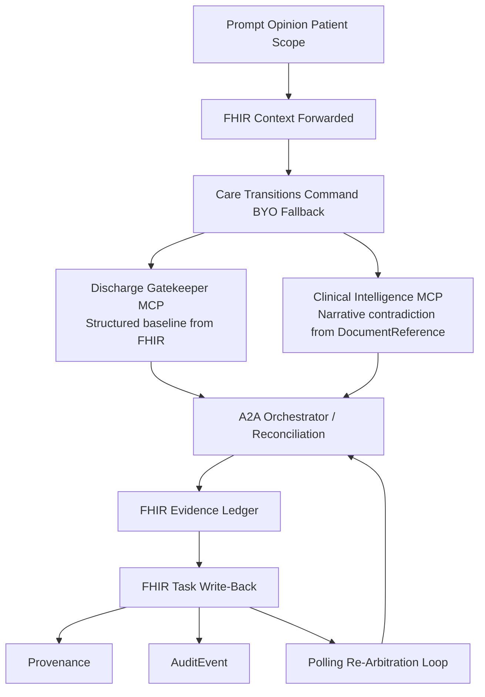

# Care Transitions Command

Care Transitions Command is a Prompt Opinion-native discharge control plane that catches the hidden note contradiction that a structured discharge-ready chart missed.

## Held-Out Demo

The held-out demo patient is **Daniel Brooks**. His structured baseline looks discharge-ready, but late narrative evidence changes the answer:

- pharmacy note: medication bridge is blocked
- nursing note: weight gain and orthopnea appear late
- case-management note: medication pickup logistics fail tonight

The system holds discharge, writes blocking FHIR Tasks, records Provenance and AuditEvent artifacts, then re-arbitrates readiness from FHIR Task state after partial resolution.

## Primitive

**Blocking evidence creates FHIR Tasks. Task completion opens the gate. The system holds discharge until the FHIR layer says otherwise.**

## Architecture



## How It Works

### Prompt Opinion Patient Scope

- The judged direct lane uses Prompt Opinion Patient Scope with the existing workspace selected for the final demo.
- Patient selection is visible in the launchpad and the chat surface shows the `FHIR Context` badge.
- `Care Transitions Command BYO Fallback` is the live direct lane.

### FHIR-Native Control Plane

- `Discharge Gatekeeper MCP` reads structured discharge context from FHIR-shaped resources.
- `Clinical Intelligence MCP` reads note/document contradiction evidence and reconciles it against the structured posture.
- `external A2A orchestrator` remains the synchronous architecture-proof lane for fused one-turn orchestration.

### Honest Local Demo Routing

Structured EHR resources — observations, medications, orders — flow through Prompt Opinion’s FHIR context. Narrative notes live in the care documentation layer, accessed through the Clinical Intelligence MCP.

For the local endgame demo, Prompt Opinion Patient Scope IDs for Daniel, Maria, and Olivia are mapped into seeded local FHIR bundles so the runtime can prove deterministic reads, Task write-back, Provenance, AuditEvent, and polling re-arbitration without claiming production hospital connectivity.

## Visible Outputs

Every successful judged answer should converge on:

1. discharge readiness verdict
2. blocker list with severity
3. evidence trace by source
4. prioritized next-step checklist
5. clinician handoff brief
6. patient-friendly discharge instructions

## Re-Arbitration Loop

Prompt 4 is not just persuasive LLM text. The backend control plane:

1. reads outstanding FHIR Tasks for the selected encounter
2. marks only the resolved gates as completed
3. recomputes unresolved blocker categories
4. keeps `clinical_stability` unresolved when orthopnea persists
5. writes fresh AuditEvent and Provenance artifacts

This is why a partial resolution does **not** falsely clear discharge.

## Scenario Pack

- **Daniel Brooks**: held-out final demo patient, heart-failure discharge with medication access, symptom change, home monitoring, and logistics risk
- **Maria Alvarez**: regression trap patient, preserves the canonical contradiction lane
- **Eleanor Singh**: functional/cognitive hidden-risk case for scenario-matrix coverage
- **Olivia Chen**: clean control, stays `ready` with zero blocking Tasks

## Safety Boundaries

- no autonomous discharge authority
- no custom frontend
- no third MCP
- no A2A streaming
- no production EHR integration claim
- no full Epic SMART claim
- no real FHIR webhook/subscription dependency claim

The system supports clinician review by surfacing readiness posture, contradictions, blockers, evidence, and next actions.

## Local Run

### Install

Run from repo root:

```bash
npm --prefix po-community-mcp-main/typescript ci
npm --prefix po-community-mcp-main/clinical-intelligence-typescript ci
npm --prefix po-community-mcp-main/external-a2a-orchestrator-typescript ci
```

### Seed Local FHIR

```bash
npx tsx po-community-mcp-main/scripts/seed-fhir-bundles.ts
```

This seeds the local fixture store with Daniel, Maria, Eleanor, and Olivia bundles.

### Start Services

Structured lane:

```bash
./po-community-mcp-main/scripts/start-two-mcp-local.sh
```

Orchestrator lane:

```bash
./po-community-mcp-main/scripts/start-a2a-local.sh
```

Public path proxy:

```bash
./po-community-mcp-main/scripts/start-public-path-proxy-local.sh
```

### Health Checks

```bash
./po-community-mcp-main/scripts/check-two-mcp-readiness.sh
./po-community-mcp-main/scripts/check-a2a-readiness.sh
```

## Prompt Opinion Proof

### Workspace

- reuse the existing Prompt Opinion workspace configured for the final demo
- select `Patient` scope
- select `Daniel Brooks`
- confirm `FHIR Context`
- select `Care Transitions Command BYO Fallback`

### Primary Prompt Set

1. `Is this patient safe to discharge today?`
2. `What hidden risk changed that answer? Show me the contradiction and the evidence.`
3. `What exactly must happen before discharge, and prepare the transition package.`
4. `New updates arrived: the medication bridge was delivered to bedside and the daughter arranged a working home scale, but the patient still reports orthopnea when lying flat. Re-arbitrate the discharge gates from the FHIR Tasks and evidence.`

### Provider

- Prompt Opinion model target: `GoogleFree / gemini-3.1-flash-lite`
- local Clinical Intelligence runtime may be run in `heuristic` mode for demo stability when the live Google-backed hidden-risk call is flaky

## Validation Commands

Focused endgame checks already used in this branch:

```bash
npm --prefix po-community-mcp-main/typescript run typecheck
npm --prefix po-community-mcp-main/clinical-intelligence-typescript run typecheck
npm --prefix po-community-mcp-main/external-a2a-orchestrator-typescript run typecheck
npm --prefix po-community-mcp-main/typescript run smoke:fhir-native-ingest
npm --prefix po-community-mcp-main/clinical-intelligence-typescript run smoke:fhir-narrative-ingest
npm --prefix po-community-mcp-main/clinical-intelligence-typescript run smoke:fhir-ledger
npm --prefix po-community-mcp-main/clinical-intelligence-typescript run smoke:narrative
npx tsx po-community-mcp-main/clinical-intelligence-typescript/smoke/fhir-direct-patient-scope-smoke.ts
npm --prefix po-community-mcp-main/external-a2a-orchestrator-typescript run smoke:fhir-rearbitration
```

## Proof Artifacts

- endgame run folder: `output/endgame/runs/20260510T101519Z/`
- Prompt Opinion historical proof bundle: `output/prompt-opinion-e2e/runs/`
- latest Daniel/Olivia live artifacts are being collected under the endgame run folder

## Read Next

- `PLAN.md`
- `docs/phase10-fhir-native-control-plane.md`
- `docs/phase10-heldout-patients.md`
- `docs/fhir-evidence-writeback-spec.md`
- `docs/prompt-opinion-integration-runbook.md`
- `docs/evals.md`
