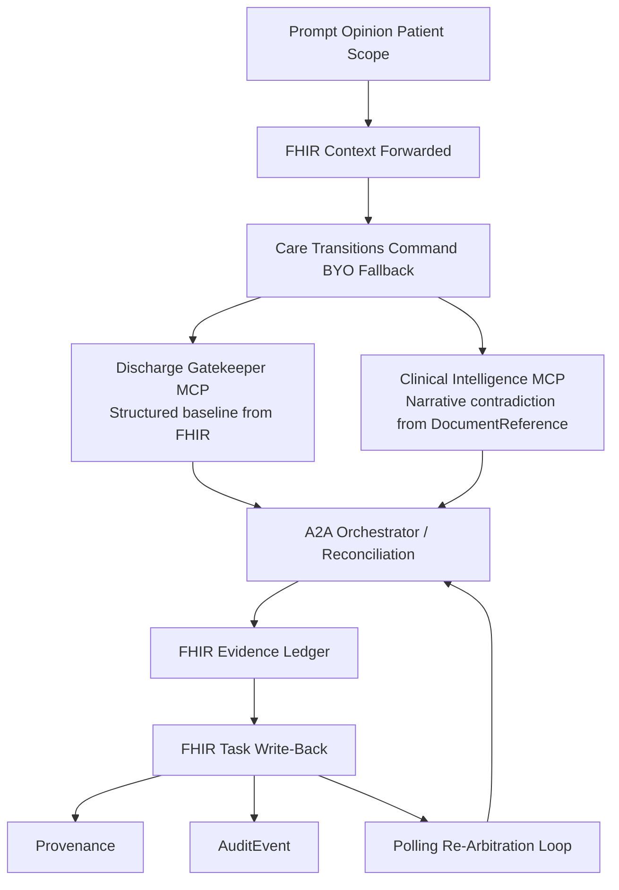
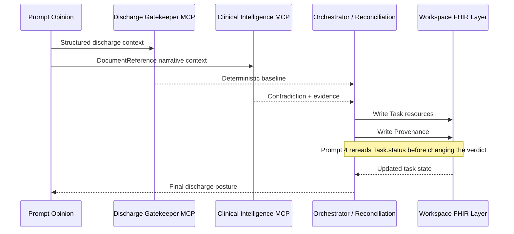

# Care Transitions Command

**A FHIR-native care-transitions control plane that catches hidden note-level contradictions, converts them into evidence-linked blocking Tasks, and holds unsafe discharges until the clinical gate actually clears.**

<table>
  <tr>
    <td bgcolor="#F3E8FF">
      <strong>The Held-Out Demo Patient: Daniel Brooks</strong><br/>
      Daniel looks discharge-ready on the deterministic structured spine. But a late pharmacy note, nursing note, and case-management note contradict that posture. The system catches the contradiction, escalates to <code>not_ready</code>, writes blocking FHIR Tasks, and refuses to clear discharge while <code>clinical_stability</code> remains unresolved.
    </td>
  </tr>
</table>

## The Inspiration

Discharge failure rarely comes from a missing summary. It comes from a contradiction that arrived too late, lived in the wrong layer, and never became explicit work.

The chart can look perfect: vitals stable, follow-up scheduled, medications reconciled. And discharge can still be unsafe because the real story changed **after** the structured snapshot:

- A late nursing note documents orthopnea and weight gain that the morning assessment never captured.
- A pharmacy note reveals the medication bridge is not actually available tonight.
- A case-management addendum shows that the caregiver who was supposed to pick up the patient cannot come.

By the time these contradictions surface in normal workflow, the patient may already be in a cab home. The risk was never in the structured fields. It was in the narrative — and nobody converted that narrative into reviewable, trackable coordination work.

Most discharge tools answer the question. **Care Transitions Command changes the operational state.**

## The Core Primitive

<table>
  <tr>
    <td bgcolor="#EDE9FE">
      <strong>Blocking evidence creates FHIR Tasks. Task completion opens the gate. The system holds discharge until the FHIR layer says otherwise.</strong>
    </td>
  </tr>
</table>

This project is built around an exact operational wedge:
1. The deterministic chart can still say `ready`.
2. The contradiction can still arrive in narrative evidence.
3. The system converts that contradiction into concrete FHIR coordination artifacts.
4. Discharge remains held until the FHIR layer reflects the real state.

## The Demo in Action

Care Transitions Command drives a precise, held-out demonstration of hidden-risk escalation.

### Prompt 1 — "Is this patient safe to discharge today?"
The structured chart says `ready`. The system checks the notes anyway. A hidden contradiction surfaces. The final answer becomes `not_ready`. Both postures are visible: the structured baseline that looked safe, and the narrative-grounded final status that changed it.

### Prompt 2 — "What hidden risk changed that answer? Show me the contradiction and the evidence."
The system points to the exact nursing note, pharmacy note, and case-management addendum that broke the structured posture. Citations are live FHIR `DocumentReference` IDs. Every finding has a source. Nothing is asserted without a note anchor.

### Prompt 3 — "What exactly must happen before discharge, and prepare the transition package."
The contradiction becomes explicit work:
- Prioritized next steps with owners and timing.
- A clinician handoff brief & patient-facing hold instructions.
- Blocking FHIR `Task` resources are written to the workspace.
- Evidence links through `reasonReference` and recorded `Provenance`.

### Prompt 4 (Re-Arbitration) — Checking the Gate
Some blocking Tasks resolve (e.g., medication access and home monitoring). The system re-reads live `Task.status`. Non-clinical gates clear, but if `clinical_stability` is still open, the discharge remains held. **This is not a summarization tool. It is a control system with memory.**

```json
{
  "resourceType": "Task",
  "id": "dd4c6f79-...",
  "status": "requested",
  "intent": "order",
  "description": "Reassess late symptom change: orthopnea and weight gain.",
  "reasonReference": {
    "reference": "DocumentReference/7978a116-..."
  }
}
```

## Architecture

Care Transitions Command is composed of three tightly scoped components:

1. **Discharge Gatekeeper MCP** — computes the deterministic structured baseline from FHIR `Observation`, `MedicationRequest`, and `Encounter` resources.
2. **Clinical Intelligence MCP** — bounded narrative intelligence that reads `DocumentReference` resources to detect contradictions.
3. **External A2A Orchestrator** — synchronous prompt-level coordination across both MCPs, handling FHIR `Task` write-backs and re-arbitration.





## The 12-Row Decision Matrix

The final verdict is not produced by the LLM. It is produced by a deterministic decision matrix that fuses the structured baseline and the hidden-risk finding.

| Row | Structured Baseline | Hidden Risk | Disposition Impact | Final Verdict |
|---:|---|---|---|---|
| 1 | `ready` | `no_hidden_risk` | none | `ready` |
| 2 | `ready` | `hidden_risk_present` | caveat | `ready_with_caveats` |
| **3** | **`ready`** | **`hidden_risk_present`** | **not_ready** | **`not_ready`** |
| 4 | `not_ready` | `no_hidden_risk` | none | `not_ready` |

*(Row 3 is the canonical demo row: structured baseline `ready`, hidden risk present, disposition impact `not_ready`, final verdict `not_ready`.)*

## What Only Generative AI Can Do Here

A rules engine can check whether SpO2 is below 90%. It **cannot** read a free-text nursing note and understand that "patient became visibly dyspneic after six stairs" contradicts the structured resting SpO2 of 94%.

Care Transitions Command's generative AI layer (running Gemma 4 31B-IT or Gemini 3.1 Flash-Lite) performs three distinct tasks:
1. **Unstructured narrative -> structured clinical contradiction.**
2. **Open-ended evidence composition.**
3. **Cross-layer synthesis at the patient level.**

The deterministic layer exists because generative AI should not invent discharge blockers, fabricate evidence, or hallucinate FHIR resources. Every FHIR resource shape is hardcoded and every contradiction finding has a `DocumentReference` citation. **The model advises; the deterministic layer decides and writes.**

## Scenario Pack & Proof

| Patient | Role In Proof | Expected Outcome |
| --- | --- | --- |
| **Daniel Brooks** | Held-out live demo patient | `not_ready` after contradiction; Prompt 4 partial resolution still does not clear `clinical_stability` |
| **Olivia Chen** | Clean control | `ready`, `no_hidden_risk`, zero blocking Tasks |
| **Eleanor Singh** | Scenario matrix safety case | `not_ready` with mobility / fall / home-support failure |
| **Maria Alvarez** | Regression trap | contradiction remains conservative and avoids Daniel bleed |

<table>
  <tr>
    <td bgcolor="#EEF2FF">
      <strong>Live on Prompt Opinion's workspace FHIR layer</strong><br/>
      Daniel, Maria, Olivia, and Eleanor all have prompt-opinion-hosted <code>DocumentReference</code> evidence. Daniel's live proof path also writes real PO <code>Task</code> and <code>Provenance</code> resources.
    </td>
  </tr>
</table>

## Local Run

### Install

```bash
npm --prefix po-community-mcp-main/typescript ci
npm --prefix po-community-mcp-main/clinical-intelligence-typescript ci
npm --prefix po-community-mcp-main/external-a2a-orchestrator-typescript ci
```

### Seed Local FHIR

```bash
npx tsx po-community-mcp-main/scripts/seed-fhir-bundles.ts
```

### Start Services

```bash
./po-community-mcp-main/scripts/start-two-mcp-local.sh
./po-community-mcp-main/scripts/start-a2a-local.sh
./po-community-mcp-main/scripts/start-public-path-proxy-local.sh
```

### Health Checks

```bash
./po-community-mcp-main/scripts/check-two-mcp-readiness.sh
./po-community-mcp-main/scripts/check-a2a-readiness.sh
curl -s https://underpaid-passion-unloaded.ngrok-free.dev/readyz
```

## Proof Artifacts

- Current endgame audit: `output/endgame/runs/20260510T101519Z/final-endgame-audit.md`
- Current FHIR consolidation proof: `output/endgame/runs/20260510T160443Z-fhir-consolidation/po-workspace-proof/summary.md`
- Current Daniel full browser proof: `output/playwright/20260510T-final-daniel-p1-p4-autoprep/`
- Current Olivia control: `output/playwright/20260510T-final-olivia-p1-longwait/`
- Current A2A consult proof: `output/playwright/20260510T-final-a2a-vc-longwait/`

## Safety Boundaries

Care Transitions Command is decision support, not autonomous discharge authority.
- Every finding cites a source.
- Every gate has an owner.
- Every verdict is reviewable by a clinician.
- No production EHR integration claim, full Epic SMART claim, or autonomous webhook claim.

It supports clinician review by surfacing readiness posture, contradictions, blockers, evidence, and coordination work. **It does not replace clinician authority.**
