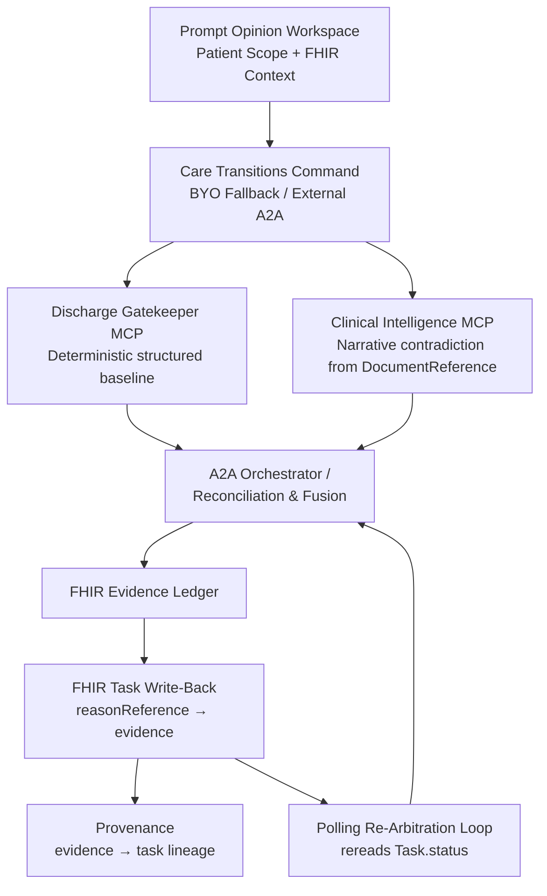
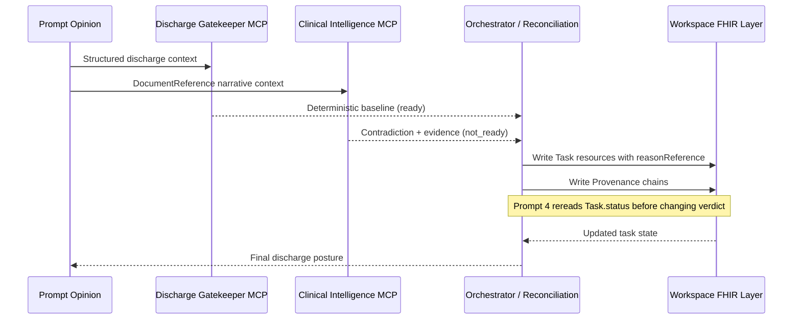

# Care Transitions Command

> A Prompt Opinion-native discharge control plane that catches the hidden contradiction a clean structured chart missed, writes blocking FHIR work items, and holds discharge until the FHIR layer says the right gates are resolved.

---

## The held-out demo in 45 seconds

**Daniel Brooks** looks discharge-ready on every structured field. Vitals stable. Follow-up scheduled. Medications reconciled. The deterministic spine says `ready`.

Then three late notes arrive:

1. **Pharmacy note** — the medication bridge is not actually available tonight
2. **Nursing note** — late orthopnea and 3-lb weight gain since morning
3. **Case-management note** — pickup logistics failure; no confirmed caregiver

The system escalates to `not_ready`, cites the exact `DocumentReference` IDs, writes blocking FHIR `Task` resources, links each to its evidence through `reasonReference`, and records `Provenance`.

A week later, medication access and home monitoring are resolved. The system rereads live `Task.status`. Non-clinical gates clear. But `clinical_stability` is still open.

The answer stays `not_ready`.

This is not a summarization tool. It is a control system with memory.

---

## The primitive

> **Blocking evidence creates FHIR Tasks. Task completion opens the gate. The system holds discharge until the FHIR layer says otherwise.**

Most discharge tools answer the question. Care Transitions Command changes the operational state.

The dangerous moment in discharge planning is not that the model failed to summarize a chart. The dangerous moment is that a patient looked ready on the morning structured snapshot, but a late note changed the reality — and nobody converted that contradiction into explicit, reviewable work.

This system is built around that exact wedge:

- the deterministic chart can still be `ready`
- the contradiction can still arrive in narrative evidence
- the system can still convert that contradiction into concrete FHIR coordination artifacts
- discharge can still remain held until the FHIR layer reflects the real state

---

## Architecture

### Component diagram



### Sequence diagram



### Component responsibilities

**Discharge Gatekeeper MCP**
- Computes the deterministic structured discharge posture from FHIR observations, medications, orders, and encounters
- Normalizes patient context against a canonical 8-category blocker taxonomy
- Emits provisional verdicts: `ready`, `ready_with_caveats`, `not_ready`
- Never reasons over free-text notes

**Clinical Intelligence MCP**
- Reads narrative evidence from FHIR `DocumentReference` resources
- Detects contradictions against the structured baseline using bounded reasoning
- Returns cited findings with explicit `DocumentReference` anchors
- Never fabricates hidden risk when no contradiction exists
- Exposes `rearbitrate_discharge_readiness` for Prompt 4 re-arbitration

**external A2A orchestrator**
- Receives the Prompt Opinion prompt via synchronous A2A v1 JSON-RPC
- Calls Discharge Gatekeeper MCP first, then Clinical Intelligence MCP when note review is warranted
- Fuses deterministic and narrative evidence into one user-visible answer
- Writes blocking FHIR `Task` resources with `reasonReference` links
- Records `Provenance` chains from evidence to task
- Supports polling re-arbitration: rereads `Task.status` before changing a prior verdict

---

## What is real today

| Claim | Evidence | Status |
|---|---|---|
| Live PO `DocumentReference` evidence | Daniel, Maria, Olivia, Eleanor have PO-hosted notes | Green |
| Live PO `Task` write-back | Daniel's proof path writes real `Task` resources | Green |
| Live PO `Provenance` write-back | Evidence-to-task lineage recorded | Green |
| Prompt 4 re-arbitration | Backend rereads live `Task.status` before verdict change | Green |
| Live `AuditEvent` write-back | PO workspace rejects current shape; local proof exists | Yellow — documented honestly |
| Full A2A 3-prompt lane | One-turn assembled proof green; full chat routing platform-blocked | Yellow — fallback lane primary |

The current live PO proof chain is `DocumentReference` + `Task` + `Provenance`.

---

## Scenario pack

| Patient | Role in proof | Structured posture | Final verdict | What it proves |
|---|---|---|---|---|
| **Daniel Brooks** | Held-out live demo | `ready` | `not_ready` | Contradiction detection + FHIR writeback + re-arbitration |
| **Olivia Chen** | Clean control | `ready` | `ready` | No forced escalation; zero blocking Tasks |
| **Eleanor Singh** | Safety case | `ready` | `not_ready` | Mobility / fall / home-support contradiction generalizes |
| **Maria Alvarez** | Regression trap | `ready` | `not_ready` | Conservative contradiction; no Daniel bleed |

---

## What judges should notice

### Prompt 1 — "Is this patient safe to discharge today?"
- The structured chart looked `ready`
- The final answer became `not_ready`
- PO `DocumentReference`, `Task`, and `Provenance` IDs are visible

### Prompt 2 — "What hidden risk changed that answer? Show me the contradiction and the evidence."
- The contradiction is explicit
- The evidence is Daniel-specific
- Citations anchor to actual `DocumentReference` resources
- The answer does not bleed Maria artifacts or generic demo text

### Prompt 3 — "What exactly must happen before discharge, and prepare the transition package."
- The contradiction becomes owner / action / timing work
- The answer surfaces FHIR `Task` IDs, not just prose
- The handoff stays conservative and clinically bounded

### Prompt 4 — "Has anything changed? Re-arbitrate."
- The system rereads live FHIR Tasks
- Completed non-clinical gates clear
- `clinical_stability` remains unresolved
- The final answer stays `not_ready`

---

## Tech stack

| Layer | Technology |
|---|---|
| Agent framework | Model Context Protocol (MCP) SDK v1.25.1 |
| Runtime | TypeScript 5.8, Express 5.1, tsx |
| Validation | Zod 4.2 |
| FHIR client | `@smile-cdr/fhirts` 2.3.0 + native REST |
| Protocol | A2A v1 over JSON-RPC 2.0 (synchronous, non-streaming) |
| Context | Prompt Opinion Patient Scope + FHIR R4 Bearer token |
| LLM | Google Gemini 2.5 Flash (bounded note reasoning only) |
| Evidence layer | FHIR R4 `Task`, `Provenance`, `DocumentReference` |

---

## Local run

### Install

```bash
npm --prefix po-community-mcp-main/typescript ci
npm --prefix po-community-mcp-main/clinical-intelligence-typescript ci
npm --prefix po-community-mcp-main/external-a2a-orchestrator-typescript ci
```

### Seed local FHIR

```bash
npx tsx po-community-mcp-main/scripts/seed-fhir-bundles.ts
```

### Start services

```bash
# Terminal 1 — both MCPs
./po-community-mcp-main/scripts/start-two-mcp-local.sh

# Terminal 2 — A2A orchestrator
./po-community-mcp-main/scripts/start-a2a-local.sh

# Terminal 3 — public path proxy
./po-community-mcp-main/scripts/start-public-path-proxy-local.sh
```

### Health checks

```bash
./po-community-mcp-main/scripts/check-two-mcp-readiness.sh
./po-community-mcp-main/scripts/check-a2a-readiness.sh
curl -s https://underpaid-passion-unloaded.ngrok-free.dev/readyz
```

### Release gates

```bash
# Discharge Gatekeeper MCP
npm --prefix po-community-mcp-main/typescript run test

# Clinical Intelligence MCP
npm --prefix po-community-mcp-main/clinical-intelligence-typescript run test

# external A2A orchestrator
npm --prefix po-community-mcp-main/external-a2a-orchestrator-typescript run test
```

---

## Proof artifacts

| Artifact | Path |
|---|---|
| Endgame audit | `output/endgame/runs/20260510T101519Z/final-endgame-audit.md` |
| FHIR consolidation proof | `output/endgame/runs/20260510T160443Z-fhir-consolidation/po-workspace-proof/summary.md` |
| Daniel full browser proof (P1-P4) | `output/playwright/20260510T-final-daniel-p1-p4-autoprep/` |
| Olivia clean control | `output/playwright/20260510T-final-olivia-p1-longwait/` |
| A2A consult proof | `output/playwright/20260510T-final-a2a-vc-longwait/` |

---

## Safety boundaries

- **No autonomous discharge authority.** The system supports clinician review. It does not replace it.
- **No custom frontend.** Prompt Opinion is the only user-facing surface.
- **No third MCP.** Architecture is locked at `2 MCPs + 1 external A2A`.
- **No A2A streaming.** Synchronous request/response only.
- **No production EHR integration claim.** Live proof runs against Prompt Opinion's workspace FHIR server.
- **No full Epic SMART claim.** The system speaks FHIR R4 over Bearer token; it does not claim native Epic integration.
- **No real FHIR Subscription / webhook claim.** Polling re-arbitration is used instead.

Care Transitions Command surfaces readiness posture, contradictions, blockers, evidence, and coordination work. It does not diagnose, it does not order, and it does not auto-message patients.
